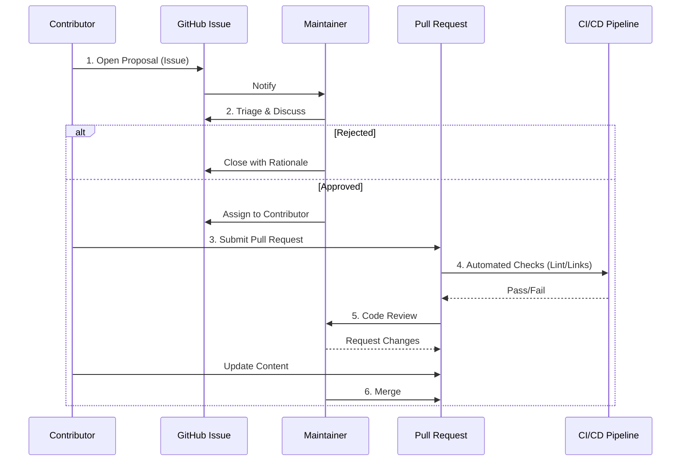

# Contribution Guidelines

## 1. Governance Model

This repository operates under a **Benevolent Dictator Model (BDFL)** for final architectural decisions, supported by a council of core maintainers for peer review. The primary objective is to maintain the semantic integrity and technical accuracy of the standards.

### 1.1 The Contribution Lifecycle

All contributions follow a strict state-transition lifecycle to ensure quality assurance.



---

## 2. Submission Standards

### 2.1 The "Evidence Requirement"
We do not accept "religious" arguments (e.g., "Language X is better because I like the syntax"). All claims must be supported by:
*   **Quantitative Data**: Benchmarks, verifiable metrics.
*   **Academic Citations**: References to computer science literature.
*   **Industrial Case Studies**: Post-mortems from reputable engineering organizations (Netflix, Google, Uber).

### 2.2 Style Guide and Tone

The repository adheres to the **Microsoft Style Guide for Technical Publications**, with specific emphasis on:

*   **Voice**: Use the *imperative* voice for instructions and the *objective* voice for descriptions.
    *   *Incorrect*: "You should try to avoid global state."
    *   *Correct*: "Avoid global state to prevent race conditions."
*   **No Anthropomorphism**: Computing systems do not "think," "want," or "know."
    *   *Incorrect*: "The load balancer decides..."
    *   *Correct*: "The load balancer routes..."
*   **Formatting**:
    *   **Headers**: Sentence case (`## Ecosystem analysis`).
    *   **Lists**: Oxford comma usage.
    *   **Code Blocks**: Must specify the language identifier (```python).

---

## 3. Pull Request Protocol

1.  **Atomicity**: Each PR should address a single conceptual change.
2.  **Linear History**: Use `git rebase` to maintain a clean commit history. Do not use merge commits.
3.  **Commit Messages**: Follow the [Conventional Commits](https://www.conventionalcommits.org/) specification.
    *   `feat: add new database consistency guide`
    *   `fix: correct typo in TCO formula`
    *   `docs: update bibliography`

## 4. Legal

By contributing to this repository, you certify that:
1.  The contribution is your original work.
2.  You grant the repository a perpetual, irrevocable license to use the content under the MIT License.
