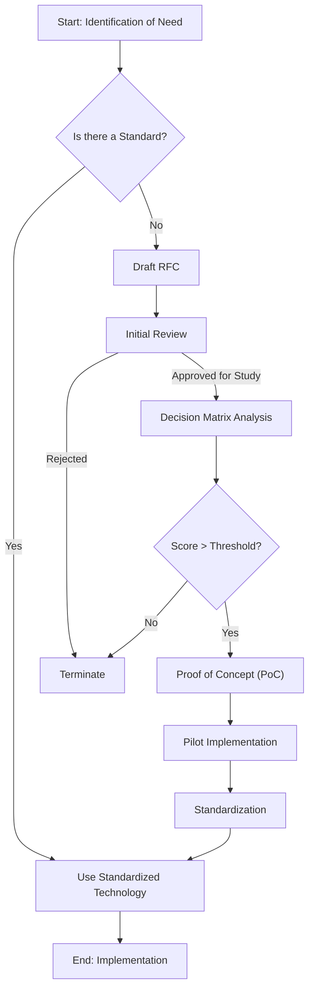

# Technology Selection Standards and Best Practices

## 1. Abstract

This repository serves as the definitive **Engineering Operating System** for technology-driven organizations. It provides a rigorous, data-driven framework for evaluating, selecting, and governing technology stacks across the entire Software Development Lifecycle (SDLC).

The methodologies are derived from **High-Reliability Organizations (HROs)**, **Google SRE principles**, and **ISO/IEC 25010 quality models**, prioritizing **Long-term Maintainability**, **Operational Stability**, and **Capital Efficiency**.

---

## 2. The Decision Protocol

All technology adoption initiatives must follow this linear state machine to mitigate cognitive bias.

*   **[Step 1: RFC Phase](./templates/technology-rfc.md)** - Define the problem space and constraints.
*   **[Step 2: Matrix Phase](./templates/decision-matrix.md)** - Quantitative scoring of candidates.

---

## 3. Repository Structure

### 📂 `standards/` - Technical Standards (17 Files)

Strict architectural guidelines for specific layers of the stack.

| Domain | Standard | Description |
| :--- | :--- | :--- |
| **Core Stack** | [Backend Selection](./standards/backend-selection-criteria.md) | Concurrency models, Type systems, GC analysis |
| | [Frontend Selection](./standards/frontend-selection-criteria.md) | CSR vs SSR, Core Web Vitals, Build Tooling |
| | [Database Selection](./standards/database-selection-criteria.md) | CAP Theorem, ACID vs BASE, Storage Engines |
| | [API Design Styleguide](./standards/api-design-styleguide.md) | REST vs gRPC vs GraphQL, Contract-First |
| **Platform** | [Infrastructure as Code](./standards/infrastructure-as-code.md) | Terraform, Pulumi, State Management, Policy as Code |
| | [Observability Strategy](./standards/observability-strategy.md) | Metrics, Logs, Traces (Prometheus, Loki, Tempo) |
| | [Cloud Provider Selection](./standards/cloud-provider-selection.md) | AWS vs GCP vs Azure, Exit Strategy |
| | [Green Computing](./standards/green-computing.md) | ARM64, Carbon-Aware Scheduling |
| **Data** | [Data Platform Architecture](./standards/data-platform-architecture.md) | ETL vs ELT, Data Mesh, Lakehouse |
| **AI/ML** | [MLOps Lifecycle](./standards/mlops-lifecycle.md) | Model Versioning, Training Infrastructure |
| | [GenAI Integration](./standards/genai-integration.md) | RAG Architecture, Prompt Engineering |
| **Mobile/Edge** | [Mobile Engineering](./standards/mobile-engineering.md) | Native vs Cross-Platform, Offline-First |
| | [Edge Computing](./standards/edge-computing.md) | CDN Strategy, IoT Protocols (MQTT) |
| **Security** | [AppSec Lifecycle](./standards/appsec-lifecycle.md) | SAST, DAST, SCA, OWASP Top 10 |
| | [Compliance & Data Privacy](./standards/compliance-and-data-privacy.md) | GDPR, SOC2, HIPAA, Data Classification |
| **Quality** | [Testing & Quality Assurance](./standards/testing-and-quality-assurance.md) | Testing Pyramid, Mutation Testing, Contract Testing |
| | [Documentation as Code](./standards/documentation-as-code.md) | Diátaxis Framework, ADRs |

---

### 📂 `guides/` - Theoretical Guides (10 Files)

Strategic deep-dives into engineering methodologies.

| Topic | Guide | Description |
| :--- | :--- | :--- |
| **Strategy** | [Ecosystem Evaluation](./guides/ecosystem-evaluation.md) | Velocity Coefficient, Bus Factor Analysis |
| | [Total Cost of Ownership](./guides/total-cost-of-ownership.md) | TCO Equation, Cognitive Load Theory, FinOps |
| | [Vendor Risk Assessment](./guides/vendor-risk-assessment.md) | SaaS Evaluation Scorecard, Exit Strategy |
| **Architecture** | [Distributed Systems Patterns](./guides/distributed-systems-patterns.md) | Saga Pattern, Circuit Breakers, Idempotency |
| | [Legacy Modernization](./guides/legacy-modernization-strategy.md) | Strangler Fig Pattern, Technical Debt Interest |
| **Operations** | [SRE Methodology](./guides/sre-methodology.md) | SLI/SLO/SLA, Error Budgets, Burn Rates |
| | [Test Data Management](./guides/test-data-management.md) | Testcontainers, PII Masking, Synthetic Data |
| | [Mobile Release Strategy](./guides/mobile-release-strategy.md) | Fastlane, OTA Updates, Feature Flags |
| **Security** | [Threat Modeling Methodology](./guides/threat-modeling-methodology.md) | STRIDE Framework, DFD Diagrams |
| | [Responsible AI Governance](./guides/responsible-ai-governance.md) | Bias Detection, SHAP, Human-in-the-Loop |

---

### 📂 `rfcs/` - Request for Comments (10 Files)

Gold-standard examples of technology proposals.

| Date | RFC | Topic | Status |
| :--- | :--- | :--- | :--- |
| 2026-01-15 | [RFC: Adopt Rust](./rfcs/2026-01-15-adopt-rust.md) | Rust for Ledger Service | Approved |
| 2026-02-01 | [RFC: Kubernetes Migration](./rfcs/2026-02-01-migration-to-kubernetes.md) | Heroku to EKS | Approved |
| 2026-02-20 | [RFC: Grafana Observability](./rfcs/2026-02-20-grafana-observability.md) | Unified LGTM Stack | Approved |
| 2026-03-01 | [RFC: Zero Trust Network](./rfcs/2026-03-01-zero-trust-network.md) | Deprecating VPN | Approved |
| 2026-03-15 | [RFC: Next.js Dashboard](./rfcs/2026-03-15-nextjs-dashboard.md) | B2B SaaS Frontend | Approved |
| 2026-04-01 | [RFC: Kafka Event Bus](./rfcs/2026-04-01-adopt-kafka-event-bus.md) | Event-Driven Architecture | Approved |
| 2026-04-15 | [RFC: GitHub Actions](./rfcs/2026-04-15-github-actions-standardization.md) | CI/CD Standardization | Approved |
| 2026-05-01 | [RFC: Adopt Flutter](./rfcs/2026-05-01-adopt-flutter.md) | Mobile Unification | Approved |
| 2026-06-01 | [RFC: Vector Search](./rfcs/2026-06-01-adopt-vector-search.md) | Semantic Search | Approved |
| 2026-07-01 | [RFC: Internal Dev Portal](./rfcs/2026-07-01-adopt-internal-dev-portal.md) | Backstage Adoption | Draft |

---

### 📂 `decisions/` - Decision Matrices (6 Files)

Quantitative evaluations demonstrating the scoring methodology in action.

| Date | Decision | Topic | Winner |
| :--- | :--- | :--- | :--- |
| 2026-01-15 | [Ledger Language](./decisions/2026-01-15-ledger-language.md) | Rust vs Go for transaction engine | Rust (Override) |
| 2026-02-01 | [Kubernetes Distribution](./decisions/2026-02-01-kubernetes-distribution.md) | EKS vs GKE vs AKS | EKS |
| 2026-02-15 | [Observability Stack](./decisions/2026-02-15-observability-stack.md) | Datadog vs Grafana Stack | Grafana Stack |
| 2026-03-01 | [Frontend Framework](./decisions/2026-03-01-frontend-framework.md) | Next.js vs Remix vs Nuxt | Next.js |
| 2026-04-01 | [CI/CD Platform](./decisions/2026-04-01-cicd-platform.md) | GitHub Actions vs GitLab CI | GitHub Actions |
| 2026-05-01 | [Database (OLTP)](./decisions/2026-05-01-database-oltp.md) | Aurora vs CockroachDB | Aurora (Override) |

---

### 📂 `templates/` - Reusable Templates (6 Files)

Scaffolding documents for standardized processes.

| Template | Description | Use Case |
| :--- | :--- | :--- |
| [Technology RFC](./templates/technology-rfc.md) | Structured proposal format | Proposing new technologies |
| [Decision Matrix](./templates/decision-matrix.md) | Weighted scoring methodology | Quantitative evaluation |
| [ADR Template](./templates/adr-template.md) | Architectural Decision Record | Documenting "Why" decisions |
| [Post-Mortem](./templates/post-mortem-template.md) | Incident analysis report | Blameless retrospectives |
| [Vendor Scorecard](./templates/vendor-assessment-scorecard.md) | SaaS risk evaluation | Third-party procurement |
| [Service Catalog](./templates/service-catalog-template.md) | Backstage `catalog-info.yaml` | Internal portal registration |

---

### 📂 `tools/` - CLI Automation (6 Files)

Python scripts for repository automation and validation.

| Tool | Command | Description |
| :--- | :--- | :--- |
| RFC Scaffolder | `python tools/scaffold_rfc.py` | Interactive wizard to generate compliant RFCs |
| Matrix Validator | `python tools/score_matrix.py <path>` | Mathematical verification of decision matrices |
| ADR Generator | `python tools/generate_adr.py` | Create new ADRs with auto-incrementing IDs |
| Link Checker | `python tools/check_links.py` | Validate all internal markdown links |
| Repo Statistics | `python tools/repo_stats.py` | Generate comprehensive statistics report |
| Post-Mortem Generator | `python tools/generate_postmortem.py` | Create incident reports from template |

---

### 📂 `.github/workflows/` - CI/CD Pipelines (5 Files)

Automated quality gates and repository management.

| Workflow | Trigger | Description |
| :--- | :--- | :--- |
| **Quality Assurance** | Push/PR | Link checking (Lychee) + Markdown linting |
| **Security Scanning** | Push/PR/Weekly | TruffleHog secrets + Bandit SAST + Dependency audit |
| **Documentation Build** | Push/PR | Mermaid validation + MkDocs build |
| **Stale Management** | Daily | Auto-close inactive issues and PRs |
| **Release Management** | Tag push | Generate changelog and create GitHub releases |

---

## 4. Technology Adoption Roadmap (2026-2027)

This roadmap reflects planned RFCs and Decision Matrices for the next 12 months.

### Q2 2026 (April-June)
- ✅ RFC-008: Kafka Event Bus (APPROVED - 2026-04-01)
- ✅ RFC-009: GitHub Actions Standardization (APPROVED - 2026-04-15)
- ✅ RFC-010: Flutter Mobile Unification (APPROVED - 2026-05-01)
- ✅ RFC-011: Vector Search Adoption (APPROVED - 2026-06-01)

### Q3 2026 (July-September)
- 🔄 RFC-012: Internal Developer Portal / Backstage (DRAFT - 2026-07-01)
- 📋 Planned: gRPC Migration Strategy (Q3 target)
- 📋 Planned: AI-Powered Testing Framework (Q3 target)

### Q4 2026 (October-December)
- 📋 Planned: Advanced Observability (Distributed Tracing)
- 📋 Planned: Data Mesh Architecture Evaluation
- 📋 Planned: Green Computing Standards Update

### 2027 (Strategic)
- 🎯 Proposed: eBPF-based Security Hardening
- 🎯 Proposed: WebAssembly for Edge Computing
- 🎯 Proposed: Quantum-Safe Cryptography Evaluation

**Legend**:
- ✅ Approved - Decision made, implementation underway
- 🔄 Draft - RFC under review
- 📋 Planned - RFC authoring in progress
- 🎯 Proposed - Early exploration phase

To submit a new RFC for consideration, open a GitHub Issue with the template from [Technology RFC Template](./templates/technology-rfc.md).

---

## 5. Core Evaluation Framework (ISO/IEC 25010 Adaptation)

### 5.1 Ecosystem Stability and Maturity
*   **Metric**: $Velocity = \frac{\Delta Commits}{\Delta Time}$, $BusFactor \ge 5$.
*   **[Read the Full Guide](./guides/ecosystem-evaluation.md)**

### 5.2 Total Cost of Ownership (TCO)
*   **Formula**: $TCO = C_{license} + C_{infra} + \int_{t=0}^{T} (H_{maint} \times R_{rate}) dt$
*   **[Read the Full Guide](./guides/total-cost-of-ownership.md)**

### 5.3 Developer Experience (DX) and Tooling
*   **Components**: Debuggability, Determinism of Build Systems, Local Environment Replication.

### 5.4 Performance Efficiency
*   **Standard**: Must meet defined SLOs (Service Level Objectives) at P99 latency.

---

## 6. References and Bibliography

1.  **Kleppmann, M.** (2017). *Designing Data-Intensive Applications*. O'Reilly Media.
2.  **Forsgren, N., Humble, J., & Kim, G.** (2018). *Accelerate: The Science of Lean Software and DevOps*. IT Revolution Press.
3.  **Sweller, J.** (1988). *Cognitive load during problem solving: Effects on learning*. Cognitive Science.
4.  **ISO/IEC.** (2011). *ISO/IEC 25010:2011 Systems and software engineering — Systems and software Quality Requirements and Evaluation (SQuaRE)*.
5.  **Beyer, B., Jones, C., Petoff, J., & Murphy, N.R.** (2016). *Site Reliability Engineering*. O'Reilly Media.

---

## 7. Governance

### Contribution Policy
We enforce a strict **Code of Conduct** and a peer-review process for all changes.
*   [Contribution Guidelines](./CONTRIBUTING.md)
*   [Code of Conduct](./CODE_OF_CONDUCT.md)

### License
Copyright © 2026. This project is licensed under the [MIT License](./LICENSE).
