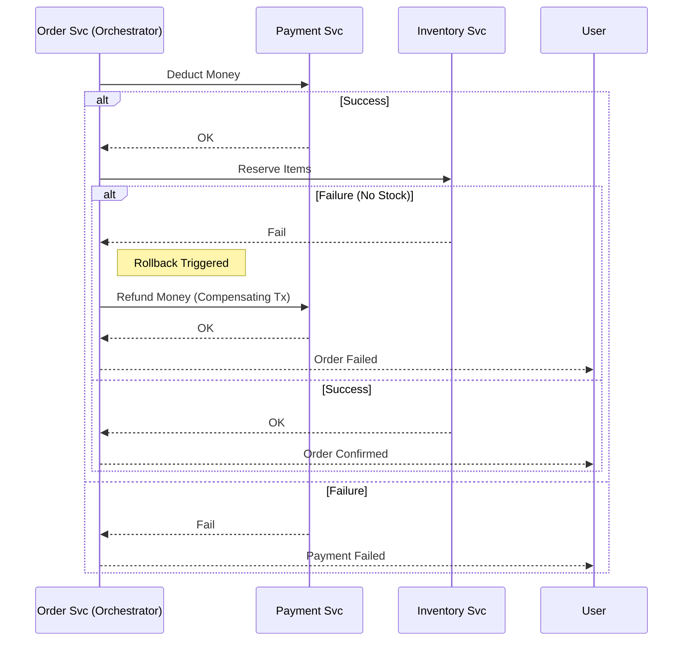

# Distributed Systems Patterns

## 1. Abstract
In a monolith, a function call always succeeds (or crashes the process). In a distributed system, a remote call can hang, fail partially, or lie. This guide catalogs the defensive patterns required to survive in a hostile network environment.

---

## 2. Resiliency Patterns (Defensive Coding)

### 2.1 Circuit Breaker
**Problem**: A downstream service is down. Retrying requests kills it further ("Thundering Herd").
**Solution**: Stop calling it for a while.
*   **State Open**: Calls fail immediately (Fast Fail).
*   **State Half-Open**: Allow 1 request to check health.
*   **State Closed**: Normal operation.

### 2.2 Bulkhead Isolation
**Problem**: One slow API (e.g., Image Resize) consumes all thread pool connections, blocking the fast API (e.g., Health Check).
**Solution**: Segregate thread pools.
*   *Analogy*: Ships have sealed compartments so a leak in one doesn't sink the ship.

### 2.3 Idempotency Keys
**Problem**: The network timed out, but the server actually processed the "Payment". Retrying charges the user twice.
**Solution**: Client sends `Idempotency-Key: uuid`. Server stores `(uuid, response)`. If it sees the uuid again, it returns the stored response without re-processing.

---

## 3. Consistency Patterns (Saga)

Distributed Transactions (2PC/XA) do not scale. We use **Sagas**.

### 3.1 The Saga Pattern (Orchestration)
A central "Orchestrator" service tells participants what to do.

### 3.2 Choreography vs Orchestration
*   **Choreography**: Events. "Order Created" -> Inventory hears it -> "Stock Reserved". (Hard to visualize).
*   **Orchestration**: Command. "Order Svc" calls "Inventory". (Easier to manage).
*   **Standard**: Use **Orchestration** for complex business logic involving >3 services.

---

## 4. The Jitter Principle
When retrying, never use fixed intervals.
*   *Bad*: `wait(1s), wait(1s)`. (Causes synchronized DDoSes).
*   *Good*: `wait(1s + random(0.1s)), wait(2s + random(0.2s))`. (Exponential Backoff + Jitter).
