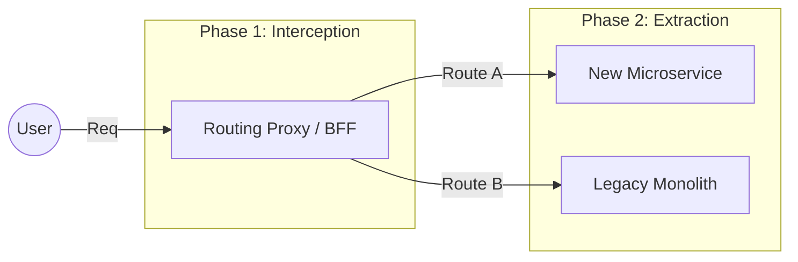

# Legacy Modernization Strategy

## 1. Abstract

Legacy systems are the "Golden Handcuffs" of successful enterprises. They generate revenue but inhibit agility. This guide defines a risk-adjusted framework for modernization, favoring incremental evolution over catastrophic "Big Bang" rewrites.

> "Legacy is not a dirty word; it is code that is still providing enough value that it hasn't been turned off yet."

---

## 2. Technical Debt: The Interest Rate Model

We treat Technical Debt as a financial instrument. 

*   **Principal**: The effort required to "repay" (refactor/rewrite).
*   **Interest Rate**: The daily friction (bugs, slow velocity, incident frequency) caused by the debt.
*   **Default Scoring**: If a system has a high interest rate, modernization is mandatory even if the business is profitable.

---

## 3. The Modernization Patterns

### 3.1 The Strangler Fig Pattern (Standard)

The primary method for decommissioning monoliths. We grow the new system around the edges of the old until the old system is consumed.

1.  **Intercept**: Introduce a proxy/Load Balancer.
2.  **Redirect**: Move a specific capability (e.g., "User Login") to a new service.
3.  **Repeat**: Gradually shift more routes until the monolith is an empty shell.

### 3.2 The Anti-Corruption Layer (ACL)

When the new system must communicate with the old, we create a mapping layer to prevent the legacy data models from "infecting" the new architecture.

---

## 4. The "Big Bang" Rejection Rule

Full-system rewrites have a **70% failure rate** (Standish Group). 

**Modernization Policy**:
*   Any proposal for a full-system rewrite must undergo a **Survival Risk Analysis**.
*   **Rejection Rationale**: "We will spend 2 years reaching feature parity while the competition builds new features."

---

## 5. Decommissioning Protocol

Deleting code is as important as writing it.

1.  **Ghost Mode**: Stop all writes to the legacy component.
2.  **Read-Only Period**: Allow legacy data to exist for auditing (30-90 days).
3.  **The "Scream Test"**: Turn it off in staging for 24 hours. If no one screams, proceed to Production shutdown.
4.  **Audit Exit**: Archive final DB snapshots to cold storage (S3 Glacier) before deleting compute.
