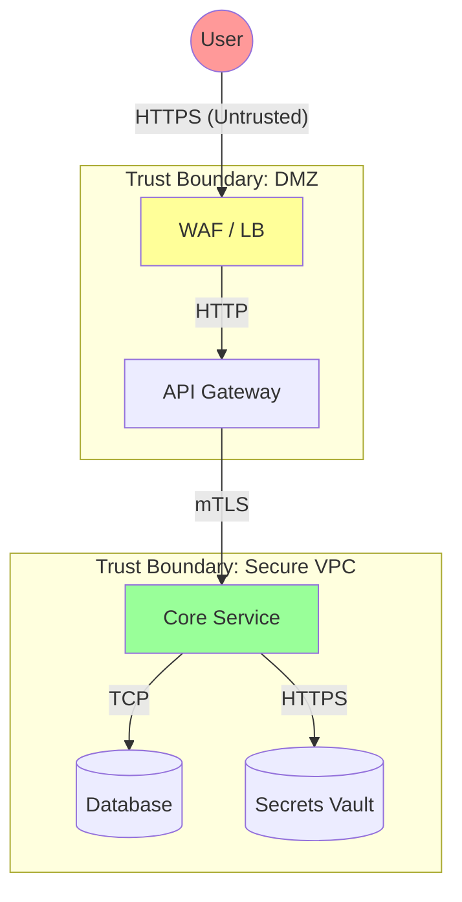

# Threat Modeling Methodology

## 1. Abstract
Threat Modeling is "Security Design". It identifies vulnerabilities before a single line of code is written. It is the most cost-effective security activity available.

> "You cannot build a secure castle if you build it on a swamp."

---

## 2. When to Model?
*   **Design Phase**: For every new Microservice or API.
*   **Architecture Change**: When adding a new data flow (e.g., "Export to S3").
*   **Trigger**: Any change dealing with PII (Personally Identifiable Information).

---

## 3. The STRIDE Framework

We use the Microsoft STRIDE model to categorize potential attacks.

| Category | Definition | Violation of Property | Mitigation Standard |
| :--- | :--- | :--- | :--- |
| **S**poofing | Impersonating another user/system. | **Authenticity** | MFA, mTLS (Service-to-Service), Strong Session Management. |
| **T**ampering | Modifying data on disk or network. | **Integrity** | Hash Signatures (HMAC), Code Signing, TLS. |
| **R**epudiation | "It wasn't me". Denying an action. | **Non-repudiation** | Immutable Audit Logs, Digital Signatures. |
| **I**nformation Disclosure | Leaking sensitive data. | **Confidentiality** | Encryption (At Rest+Transit), Data Masking, Least Privilege. |
| **D**enial of Service | Exhausting resources. | **Availability** | Rate Limiting, Autoscaling, Timeout Budgets. |
| **E**levation of Privilege | Gaining admin rights. | **Authorization** | Input Validation, RBAC checks on *every* object access. |

---

## 4. The Process: Data Flow Diagrams (DFD)

A Threat Model revolves around a DFD. We map the flow of data across **Trust Boundaries**.

**Analysis Steps**:
1.  **Map the Flow**: Draw the diagram above.
2.  **Identify Boundaries**: Where does data cross from "Public" to "Private"? (The WAF -> API line).
3.  **Apply STRIDE**: For every red line, ask "Can I spoof this? Can I DoS this?".

## 5. Risk Scoring (DREAD)

Once a threat is found, we score it to prioritize fixes.
*   **D**amage potential
*   **R**eproducibility
*   **E**xploitability
*   **A**ffected users
*   **D**iscoverability

*Score = (D+R+E+A+D) / 5*. High scores imply blockers for release.
