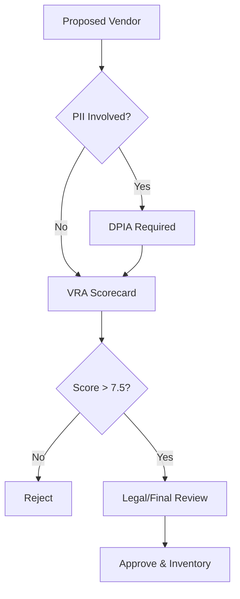

# Vendor Risk Assessment (VRA) Guide

## 1. Abstract
When we adopt a 3rd party technology (e.g., a managed DB or a Monitoring SaaS), we inherit their risk. The Vendor Risk Assessment (VRA) is the process of quantifying that inheritance before signing a contract.

---

## 2. Evaluation Dimensions

We use a weighted scorecard to evaluate a potential vendor.

### 2.1 Security and Compliance (Weight: 40%)
*   **Certifications**: Do they have SOC 2 Type II or ISO 27001?
*   **Penetration Testing**: Do they share their latest external audit summary?
*   **Data Encryption**: Do they support "Customer Managed Keys" (BYOK)?

### 2.2 Financial and Operational Viability (Weight: 30%)
*   **Funding / Profitability**: Is the company at risk of disappearing in 12 months?
*   **SLA Guarantees**: Do they offer at least 99.9% uptime with financial penalties?

### 2.3 Exit Strategy (The "Lock-in" Risk) (Weight: 30%)
*   **Data Portability**: How do we get our data out? (JSON, CSV, SQL Dump).
*   **Time to Migrate**: If we need to leave, how long would a migration take?
*   **Standard**: Any vendor that doesn't allow full raw data export is **Rejected**.

---

## 3. The "Shadow IT" Problem

Unauthorized adoption of SaaS (e.g., a developer using an unvetted PDF converter API) is the #1 cause of data leaks.

**Policy**:
1. All new SaaS vendors must be logged in a **Central Inventory**.
2. Any service processing PII must undergo a **DPIA (Data Protection Impact Assessment)**.

---

## 4. Sub-processor Governance

We must identify where our vendors send *our* data.
*   *Example*: If we use "SaaS A" and they use "SaaS B" for analytics, we are legally responsible for "SaaS B's" compliance.

**Requirement**: Every vendor contract must include a **DPA (Data Processing Addendum)** clearly listing all sub-processors.

---

## 5. Decision Protocol for New Vendors

