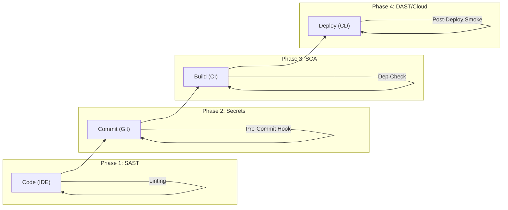

# Application Security (AppSec) Standards

## 1. Introduction
Security is not a gate at the end of the project; it is a continuous property of the pipeline. We adhere to the **DevSecOps** philosophy: "Shift Left".

> **Principle**: "It is cheaper to fix a vulnerability in the IDE ($80) than in Production ($80,000 + Reputation Damage)."

---

## 2. The Secure Software Development Life Cycle (SSDLC)

We enforce automated security gates at four distinct stages.

### 2.1 Phase 1: Static Application Security Testing (SAST)
*   **Tool**: SonarQube / GitHub Advanced Security.
*   **Scope**: Analyzes source code for known patterns (SQL Injection, XSS) *without executing it*.
*   **Rule**: Block PR if extensive "Code Smells" or "High Vulnerabilities" are found.

### 2.2 Phase 2: Secret Scanning
*   **Tool**: `git-secrets` / TruffleHog.
*   **Scope**: Detects AWS Keys, API Tokens, or Private Keys.
*   **Rule**: Immediate rejection of commit. Rotated compromised keys immediately.

### 2.3 Phase 3: Software Composition Analysis (SCA)
*   **Tool**: Snyk / Dependabot / Trivy.
*   **Scope**: Checks `package.json` / `go.mod` against CVE databases.
*   **Standard**: No High/Critical vulnerabilities allowed in production artifacts.

### 2.4 Phase 4: Dynamic Analysis (DAST)
*   **Tool**: OWASP ZAP.
*   **Scope**: Attacks the running application (black-box).
*   **Checks**: CORS headers, Cookie attributes (`Secure`, `HttpOnly`), SSL Configuration.

---

## 3. OWASP Top 10 Mitigation

| Risk | Mitigation Standard |
| :--- | :--- |
| **A01: Broken Access Control** | Use strict RBAC. Deny by default. Test limits (`/admin` from user account). |
| **A02: Cryptographic Failures** | Encrypt Data-at-Rest (AES-256). Use TLS 1.3. disable deprecated Ciphers. |
| **A03: Injection (SQL/NoSQL)** | **Never** concat strings. Always use Parameterized Queries (ORMs do this by default). |
| **A05: Security Misconfiguration** | Remove default accounts/passwords. Automate hardening (CIS Benchmarks). |

---

## 4. Vulnerability Management
When a CVE is discovered in production:
1.  **Triage**: Assess "Reachability". (Is the vulnerable function actually used?).
2.  **SLA**: 
    *   **Critical (CVSS > 9)**: 24 Hours.
    *   **High (CVSS > 7)**: 7 Days.
    *   **Medium**: 30 Days.
3.  **Remediation**: Upgrade dependency or apply WAF Patch.

---

## See Also
*   **[Threat Modeling Methodology](../guides/threat-modeling-methodology.md)**: Using STRIDE to identify threats before writing code.
*   **[Infrastructure as Code](./infrastructure-as-code.md)**: Policy as Code (Checkov) for infrastructure compliance.
*   **[RFC: Zero Trust Network](../rfcs/2026-03-01-zero-trust-network.md)**: Eliminating implicit network trust.
*   **[Compliance & Data Privacy](./compliance-and-data-privacy.md)**: Regulatory frameworks (GDPR, SOC2).

