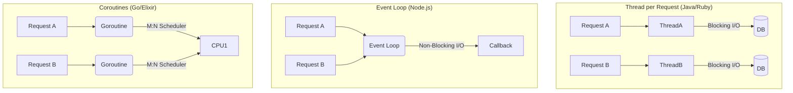

# Backend Technology Selection Standards

## 1. Introduction
The selection of a backend ecosystem is a foundational architectural decision. It dictates not just the syntax, but the concurrency model, memory safety guarantees, and the operational "floor" of the system.

> "The goal of a backend architecture is to maximize throughput while minimizing the variance in latency."

---

## 2. Concurrency Models: The Architectural Core

The most defining characteristic of a backend runtime is how it handles multiple simultaneous connections.

### 2.1 The Big Three Models



| Model | Pros | Cons | Best For |
| :--- | :--- | :--- | :--- |
| **Thread-per-Request** | Simple mental model. CPU-bound safe. | High Memory overhead (1MB/thread). Context switch cost. | Enterprise CRUD, Monoliths. |
| **Event Loop** | Low overhead. High I/O throughput. | **CPU-blocking** halts entire server. Callback hell. | API Gateways, Streaming. |
| **Coroutines (M:N)** | Best of both. Blocking style syntax, non-blocking execution. | Runtime complexity (Scheduler). | Microservices, High-Scale Systems. |

---

## 3. Cognitive Load vs Control: A Code Comparison

We evaluate languages not by "elegance" but by the **Cognitive Load** required to achieve correctness.

### Scenario: A Simple HTTP Handlers

**Option A: Go (Low Cognitive Load)**
*Focus: Simplicity, Readability. "Only one way to do it."*
```go
func handler(w http.ResponseWriter, r *http.Request) {
    // Goroutines usually handle concurrency automatically relative to the OS
    data, err := db.Query("SELECT * FROM users")
    if err != nil {
        http.Error(w, err.Error(), 500)
        return
    }
    json.NewEncoder(w).Encode(data)
}
```

**Option B: Rust (High Control / High Load)**
*Focus: Memory Safety, Zero Garbage Collection. Explicit Ownership.*
```rust
async fn handler(pool: web::Data<PgPool>) -> impl Responder {
    // Must explicitly handle Async/Await and Ownership borrowing
    let rows = sqlx::query!("SELECT * FROM users")
        .fetch_all(pool.get_ref()) // Explicit borrowing
        .await;
    
    match rows {
        Ok(users) => HttpResponse::Ok().json(users),
        Err(_) => HttpResponse::InternalServerError().finish(),
    }
}
```

**Decision Rule**: Use **Rust** only when the GC pauses of Go/Java violate strict latency SLOs. For 95% of web services, the cognitive overhead of Rust is an "Over-Optimization."

---

## 4. Operational Deep Dive: Garbage Collection

### 4.1 The Cost of GC
In Managed Languages (Java, Go, Python, Node), the runtime pauses execution to clean memory.
*   **Stop-The-World (STW)**: The application halts completely.
*   **Throughput Impact**: 10-20% of CPU cycles are often spent on GC.

**Selection Protocol**:
1.  **Latency Insensitive** (>100ms acceptable): Use Python/Ruby.
2.  **Latency Sensitive** (<50ms): Use Go (Low pause GC).
3.  **Real-Time** (<10ms): Use Rust/C++ (No GC).

---

## 5. Type Systems and Scaling

### 5.1 Static vs Dynamic at Scale

Research (Endrikat et al., 2014) indicates that static typing reduces defect density by ~15% in large systems.

| Feature | Static (Java/Go/TS) | Dynamic (Python/JS/Ruby) |
| :--- | :--- | :--- |
| **Refactoring** | Safe (Compiler catches errors) | High Risk (Requires 100% test coverage) |
| **Documentation** | Types operate as documentation | Code often ambiguous |
| **Velocity** | Slower initial dev, Faster maintenance | Fast initial dev, Slow maintenance |

**Standard**: For any service intended to survive >12 months or be maintained by >3 engineers, **Static Typing is Mandatory**.

---

## 6. The 12-Factor Compliance (Cloud Native)

All backend services must adhere to Heroku's [12-Factor](https://12factor.net/) principles for portability.
*   **Config**: Strictly store config in the Environment (`process.env`), never in git.
*   **Disposability**: Fast startup (<5s) and graceful shutdown (SIGTERM handling).
*   **Logs**: Treat logs as event streams (stdout), do not write to files.

## 7. Containerization Profiling

Your choice of runtime affects the "Supply Chain" security and cold-start time.

| Base Image | Size | Security Posture | Use Case |
| :--- | :--- | :--- | :--- |
| **Debian/Ubuntu** | > 100MB | **Poor**. Contains `sh`, `systemd`, `apt`. Large attack surface. | Development / Debugging. |
| **Alpine Linux** | ~5MB | **Good**. Uses `musl` (can cause libc quirks). | Generic Containers (Node/Python). |
| **Distroless** | ~2MB | **Perfect**. No shell, no package manager. Just the runtime. | Production (Go/Rust/Java). |

**Rule**: Production artifacts MUST be built on **Distroless** or **Alpine** to minimize CVEs.

---

## 8. Security Primitives (Zero Trust)

We treat the internal network as hostile.

### 8.1 Identity (AuthN)
*   **Standard**: All service-to-service communication must be authenticated via **mTLS** (Mutual TLS) or Short-lived Tokens (OIDC).
*   **Libraries**: Use standardized middleware (Sentinel/Envoy), do not implement crypto yourself.

### 8.2 Authorization (AuthZ)
*   **RBAC (Role-Based)**: Coarse-grained (Admin vs User).
*   **ABAC (Attribute-Based)**: Fine-grained (User can edit *this* document if they are the *owner*).
*   **Standard**: Authorization checks must occur at the **Domain Layer**, not just the HTTP Layer.

---

## 9. The AI Exception (Python)

While we mandate Static Typing for backend services, we grant an **Exemption** to Python for AI/ML workloads.

### 9.1 Justification
The ML Ecosystem (PyTorch, Pandas, Scikit) is exclusively Python-first. Forcing ML Engineers to use Java/Go is counter-productive.

### 9.2 The "Sidecar" Pattern
To mitigate Python's performance issues (GIL), we do not run business logic in Python.
*   **Architecture**: The Core API (Go) calls the Inference Service (Python) via gRPC.
*   **Constraint**: The Python service must be stateless and focused *only* on tensor operations.

---

## See Also
*   **[API Design Styleguide](./api-design-styleguide.md)**: Contract-First API design (REST, gRPC, GraphQL).
*   **[Database Selection Criteria](./database-selection-criteria.md)**: Choosing between SQL and NoSQL.
*   **[MLOps Lifecycle](./mlops-lifecycle.md)**: Managing the ML training and inference pipeline.
*   **[RFC: Rust Adoption](../rfcs/2026-01-15-adopt-rust.md)**: Example decision for a performance-critical service.
*   **[Total Cost of Ownership Guide](../guides/total-cost-of-ownership.md)**: Financial model for technology evaluation.


