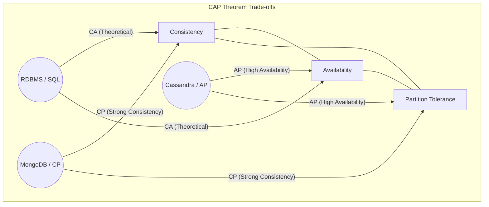

# Database Selection Standards

## 1. Introduction

Data gravity makes database migrations the single most expensive engineering operation. Selection must be driven by data structure (Relational vs. Graph) and access patterns (Read-Heavy vs. Write-Heavy), not by "hype".

---

## 2. The Theoretical Constraints (CAP Theorem)

In a distributed data store, you can only guarantee two of the three following consistency, availability, and partition tolerance properties.

*   **CP (Consistency + Partition Tolerance)**: System refuses writes if it cannot guarantee consistency. (e.g., MongoDB, Redis Cluster). *Use for: Payments, Inventory.*
*   **AP (Availability + Partition Tolerance)**: System accepts writes even if nodes disagree. (e.g., DynamoDB, Cassandra). *Use for: Social Feeds, IoT Telemetry.*

---

## 3. Storage Engine Internals: B-Tree vs LSM

Understanding the underlying data structure is critical for predicting performance.

| Feature | B-Tree (Postgres/MySQL) | LSM Tree (Cassandra/RocksDB) |
| :--- | :--- | :--- |
| **Structure** | Balanced Tree on specific pages. | Log-Structured Merge (Append-only). |
| **Write Performance** | **Moderate**: Random I/O to update pages. | **Extreme**: Sequential I/O (Append). |
| **Read Performance** | **Fast**: Direct pointer traversal. | **Slower**: Must check Memtable + SSTables. |
| **Best For** | General Purpose, Read-Heavy (80/20). | Massive Ingestion, Write-Heavy logs. |

---

## 4. Transaction Isolation Levels and Anomalies

Developers often assume "ACID" means "Perfect Isolation". It does not.

| Isolation Level | Dirty Read? | Non-Repeatable Read? | Phantom Read? | Performance Cost |
| :--- | :---: | :---: | :---: | :---: |
| **Read Uncommitted** | Yes | Yes | Yes | Low |
| **Read Committed** | No | Yes | Yes | Moderate (Default pg) |
| **Repeatable Read** | No | No | Yes | High (Default mysql) |
| **Serializable** | No | No | No | Extreme (Locking) |

### 4.1 The "Write Skew" Anomaly
*Occurs in Repeatable Read but not Serializable.*
*   **Scenario**: Two doctors on call. Both try to request leave at the same time. The system checks "Is there at least one doctor left?"
*   **Result**: Both transactions see 2 doctors. Both leave. 0 Doctors remain.
*   **Solution**: Use `FOR UPDATE` locks or Serializable isolation for invariant constraints.

---

## 5. Architectural Decision Records (ADR)

### 5.1 When to Shard?
**Never** (until you have to).
*   **Vertical Scaling First**: A single AWS `u-12tb1.112xlarge` instance has 24TB of RAM.
*   **Read Replicas Second**: Offload analytics/reporting.
*   **Sharding Last**: Introduces cross-shard join complexity and partial failures.

### 5.2 The "NoSQL" Fallacy
Do not choose NoSQL just to avoid "Schema Migrations".
*   **Schema-on-Read** implies that the application code manages the schema complexity. This is technical debt.
*   **Use Postgres JSONB** if you need flexibility within a robust ACID relational context.

---

## See Also
*   **[Backend Selection Criteria](./backend-selection-criteria.md)**: Choosing the service layer that queries the database.
*   **[Data Platform Architecture](./data-platform-architecture.md)**: Analytical data stores (Lakehouse, Data Mesh).
*   **[Distributed Systems Patterns](../guides/distributed-systems-patterns.md)**: Saga Pattern for distributed transactions.
*   **[RFC: Kafka Event Bus](../rfcs/2026-04-01-adopt-kafka-event-bus.md)**: Event sourcing as an alternative to direct DB access.

