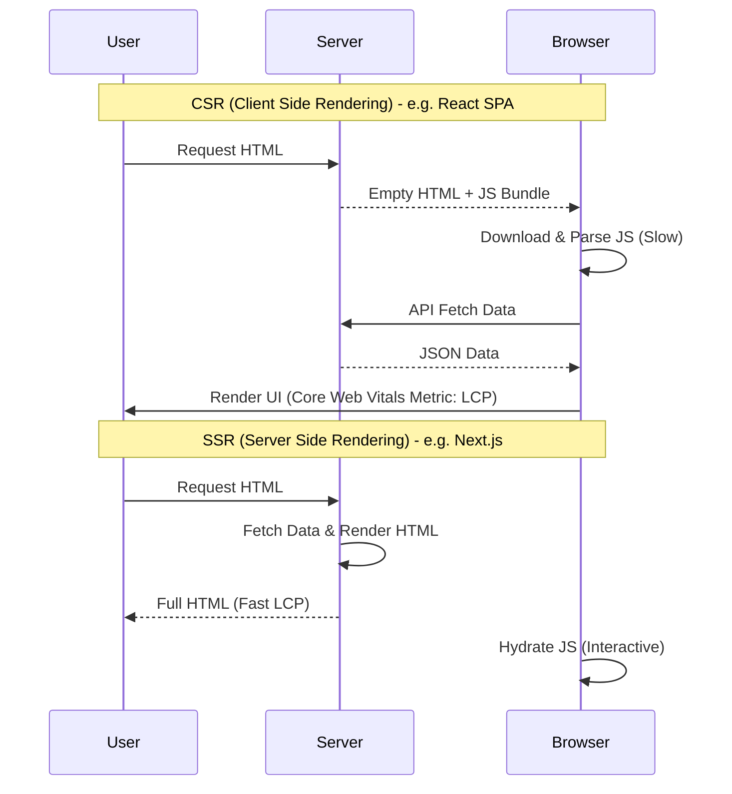

# Frontend Architecture Standards

## 1. Introduction

Frontend architecture is no longer about "HTML/CSS". It is a distributed systems problem involving state synchronization, hydration strategies, and network constraints. The primary metric is **User Perceived Performance**.

## 2. Rendering Strategies: The Core Decision

The "Where to Render" decision dictates the Time-to-First-Byte (TTFB) and Total Blocking Time (TBT).

| Strategy | LCP (Visual Load) | TTI (Interactive) | SEO | Use Case |
| :--- | :--- | :--- | :--- | :--- |
| **CSR (SPA)** | Slow | Slow | Poor | Dashboards, Internal Tools (Jira) |
| **SSR** | **Fastest** | Moderate | Excellent | E-commerce, SaaS Landing |
| **SSG (Static)** | Fast | Fast | Excellent | Blogs, Documentation |

## 3. Core Web Vitals: The Performance Contract

Google's Core Web Vitals are the hard metrics for frontend success.

### 3.1 Largest Contentful Paint (LCP)
*   **Target**: < 2.5s
*   **Standard**: Use SSR or SSG. Optimize image formats (WebP). CDN caching is mandatory.

### 3.2 Interaction to Next Paint (INP)
*   **Target**: < 200ms
*   **Standard**: Avoid long tasks on the main thread.
*   **React Concurrency**: Use `useTransition` to keep the UI responsive during heavy state updates.

### 3.3 Cumulative Layout Shift (CLS)
*   **Target**: < 0.1
*   **Standard**: Always define `width` and `height` attributes for images. Reserve space for dynamic ads/banners.

## 4. State Management Maturity Model

Do not default to Redux/Context. Use the simplest tool for the scope.

1.  **Level 1: URL State**
    *   *Source of Truth*: The URL Query Params (`?filter=active&page=2`).
    *   *Tool*: React Router / Next.js Router.
    *   *Benefit*: Shareable, Bookmarkable.
2.  **Level 2: Server State**
    *   *Source of Truth*: The API cache.
    *   *Tool*: **TanStack Query** (React Query) / SWR.
    *   *State*: `isLoading`, `isError`, `data`.
3.  **Level 3: Client Global State**
    *   *Source of Truth*: Memory.
    *   *Tool*: Zustand (Simple), Redux Toolkit (Complex).
    *   *Rule*: Only use for truly global UI state (Theme, User Session).

## 5. Build Tooling

*   **Bundler**: **Vite** is the standard. It uses ES Modules for instant dev server start, replacing Webpack.
*   **Linting**: Biome (Rust-based, fast) or ESLint + Prettier.
*   **Testing**: Vitest (Unit) + Playwright (E2E). **Cypress is considered legacy** due to performance and flake.

---

## See Also
*   **[API Design Styleguide](../standards/api-design-styleguide.md)**: Mobile optimization (Brotli, Cursor Pagination).
*   **[Decision Matrix: Frontend Framework](../decisions/2026-03-01-frontend-framework.md)**: Next.js vs Remix vs Nuxt evaluation.
*   **[RFC: Next.js Dashboard](../rfcs/2026-03-15-nextjs-dashboard.md)**: Practical adoption proposal.
*   **[Testing & QA Standards](../standards/testing-and-quality-assurance.md)**: E2E testing strategy.

