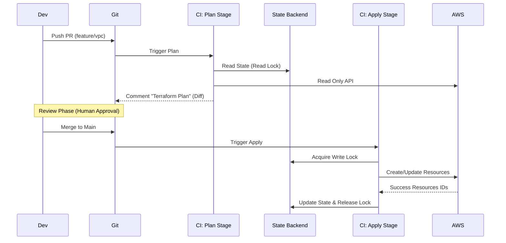

# Infrastructure as Code (IaC) Standards

## 1. Introduction
Infrastructure is no longer hardware; it is volatile software. We treat the Cloud API (AWS/GCP) as a deployment target, managed exclusively through code.

> **Rule Zero**: "ClickOps is forbidden." Console access is Read-Only.

---

## 2. Tooling Landscape

The decision between declarative (HCL/YAML) and imperative (TS/Python) defines the platform culture.

### 2.1 The Comparison Matrix

| Tool | Language | State Management | Best For |
| :--- | :--- | :--- | :--- |
| **Terraform/OpenTofu** | HCL (DSL) | Local/S3 Backend | **Standard Infrastructure** (VPC, RDS, IAM). Deterministic. |
| **Pulumi** | TS/Python/Go | Service/S3 | **Dynamic Infrastructure**. If loops/logic are required (e.g., "Create 1 queue per tenant"). |
| **Crossplane** | Kubernetes YAML | Etcd (K8s) | **GitOps purists**. Managing AWS resources via `kubectl apply`. |

**Recommendation**: Default to **Terraform**. Use Pulumi only when high-level abstraction logic is mandatory.

---

## 3. State Management Protocol

The State File (`tfstate`) is the "Brain" of the infrastructure. If it corrupts, the infra is orphaned.

### 3.1 Locking Strategy
Concurrency control is mandatory to prevent two CI jobs from applying simultaneously.
*   **AWS**: S3 Bucket (Storage) + DynamoDB Table (Locking).
*   **GCP**: GCS Bucket (Native Locking).

### 3.2 Secret Management
**NEVER** commit secrets to git.
*   *Bad*: `password = "hunter2"` in `.tf` file.
*   *Good*: `data "aws_secretsmanager_secret"` to fetch at runtime.

---

## 4. Operational Diagram: The CI/CD Pipeline

We enforce a strict separation between "Planning" (Draft) and "Applying" (Execution).



## 5. Directory Structure Standards

Do not build a "Monolith". Isolate failure domains ("Blast Radius").

```
infra/
├── modules/          (Reusable Logic)
│   ├── vpc/
│   └── rds/
├── environments/     (Live State)
│   ├── prod/
│   │   ├── main.tf
│   │   └── variables.tf
│   └── staging/
```

**Rule**: A failure in `staging` state must NEVER be able to lock/corrupt `prod`.

---

## 6. Policy as Code (Compliance)

We do not rely on code review to catch security issues. We iterate automatically using **Static Analysis**.

### 6.1 The "Guardrails"
Tools must run in the `plan` stage of CI. If they fail, the pipeline halts.

*   **Checkov** / **Trivy**: Scans Terraform for misconfigurations.
    *   *Check*: Is `aws_s3_bucket.acl` set to public? (Fail).
    *   *Check*: Is `aws_security_group` allowing `0.0.0.0/0` on port 22? (Fail).

### 6.2 OPA (Open Policy Agent)
For complex logic, we use Rego policy files.
*   **Use Case**: "Ensure all RDS instances have the `CostCenter` tag."
*   **Use Case**: "Prevent deletion of resources marked `lifecycle { prevent_destroy = true }`."

---

## See Also
*   **[Observability Strategy](./observability-strategy.md)**: Deploying the monitoring stack.
*   **[Cloud Provider Selection](./cloud-provider-selection.md)**: Choosing between AWS, GCP, and Azure.
*   **[RFC: Kubernetes Migration](../rfcs/2026-02-01-migration-to-kubernetes.md)**: IaC for EKS cluster provisioning.
*   **[AppSec Lifecycle](./appsec-lifecycle.md)**: Policy as Code (Checkov) for security compliance.


