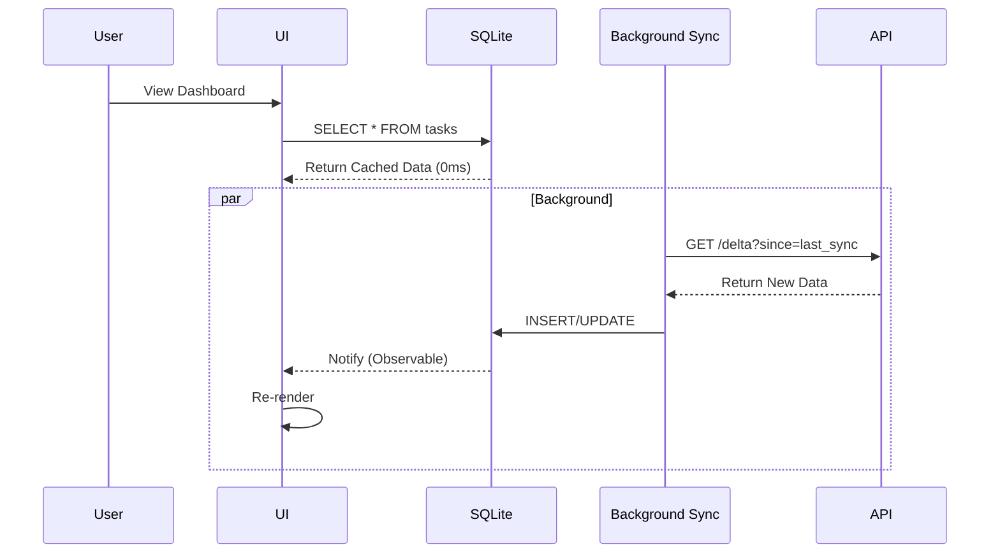

# Mobile Engineering Standards

## 1. Introduction
Mobile apps run in hostile environments: intermittent networks, dying batteries, and limited thermal envelopes. We do not build "Websites in a wrapper". We build resilient clients.

---

## 2. Technology Selection: The "Uncanny Valley"

The choice between Native and Cross-Platform is a trade-off between **Velocity** and **Fidelity**.

| Framework | Fidelity | Velocity | Developer Pool | Use Case |
| :--- | :--- | :--- | :--- | :--- |
| **Native** (Swift/Kotlin) | **Perfect**. (Use ARKit/HealthKit). | Low (2x Codebases). | Specialized (High Cost). | Bank Apps, GPS, AR/VR. |
| **Flutter** (Dart) | **High**. Skia rendering engine (60fps). | High (1 Codebase). | Niche but growing. | B2B Apps, High-Design Consumer Apps. |
| **React Native** (TS) | **Medium**. Bridges to JS thread. | Very High (Web Devs). | Massive. | CRUD Apps, E-commerce. |

**Standard**:
*   **Startup Phase**: Cross-Platform (React Native/Flutter) to find Product-Market Fit.
*   **Scale Phase**: Evaluate Native rewrites only if performance profiling proves the bridge is the bottleneck.

---

## 3. Architecture: Offline-First

Assume the user is in an elevator or on a subway. **"No Network" is a valid state.**

### 3.1 The Local Database
*   **Requirement**: All read operations must query the **Local DB** (SQLite/Realm/WatermelonDB), NOT the API.
*   **Sync Engine**: Background jobs synchronize Local DB <-> API.

---

## 4. Performance Metrology

Mobile performance is visceral.

*   **FPS (Frames Per Second)**: Must sustain **60fps**. Drop below 55fps = Bug.
*   **App Start Time**:
    *   *Cold Start*: < 2 seconds.
    *   *Warm Start*: < 500ms.
*   **Battery**: CPU usage must drop to < 1% when app is backgrounded.
