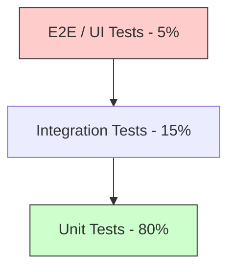

# Quality Assurance and Testing Standards

## 1. Introduction
Testing is not a post-development phase; it is an economic strategy to reduce the cost of change. We prioritize fast feedback loops and deterministic results.

> **Principle**: "The goal of testing is not to find bugs, but to provide confidence that the system meets its specification under stress."

---

## 2. Test Architecture Models

Choosing the right distribution of tests ensures high confidence with low maintenance costs.

### 2.1 The Testing Pyramid (Classic)
Focuses on isolation and speed.

### 2.2 The Testing Trophy (Modern Web)
Focuses on integration, where most bugs occur in distributed systems. (Kent C. Dodds model).

| Tier | Weight | Rationale |
| :--- | :--- | :--- |
| **Static** | Heavy | Catch typos/type errors before execution (ESLint/TypeScript). |
| **Unit** | Medium | Verify complex business logic (isolated). |
| **Integration** | **Max** | Verify that multiple components work together. High ROI. |
| **E2E** | Low | Verify the critical "Golden Path" from a user perspective. |

**Standard**: Adopt the **Testing Trophy** for frontend/web apps and the **Testing Pyramid** for backend microservices.

---

## 3. Advanced Testing Techniques

### 3.1 Contract Testing (Pact)
**Problem**: In microservices, updating Service A might break Service B without anyone knowing until production.
**Solution**: **Consumer-Driven Contracts**.
1. Service B defines a "Pact" (expected JSON structure).
2. Service A must verify against this Pact before every deploy.

### 3.2 Mutation Testing
**Problem**: 100% Code Coverage is meaningless if the assertions are weak (`expect(true).toBe(true)`).
**Solution**: **Mutation Testing** (PIT for Java, Stryker for TS/C#).
- The tool modifies the code (e.g., changes `>` to `<`).
- If the tests still pass, the "mutant survived" and the test suite is low quality.

---

## 4. Performance Testing (Load vs. Stress)

Testing must prove that the system meets its **Service Level Objectives (SLOs)**.

*   **Load Test**: Verify system behaves under expected peak load.
*   **Stress Test**: Push the system until it breaks to find the "Failure Mode" (e.g., Memory leak, DB connection exhaustion).
*   **Soak Test**: Run high load for 24 hours to find slow resource leaks.

---

## 5. Metric Standard: Verification over Coverage

*   **Code Coverage**: Minimum threshold of **80%**. 
*   **Crucial Rule**: Coverage must be measured at the **Branch** level, not just the Line level.
*   **Success Metric**: "Time to detect regression". If a bug reaches production that could have been caught by a test, it is a failure of the Testing Strategy.

---

## See Also
*   **[Test Data Management](../guides/test-data-management.md)**: Testcontainers, Mocking, and PII Masking.
*   **[API Design Styleguide](../standards/api-design-styleguide.md)**: Contract-First APIs enable Contract Testing.
*   **[Decision Matrix: CI/CD Platform](../decisions/2026-04-01-cicd-platform.md)**: Choosing the test execution platform.
*   **[RFC: GitHub Actions](../rfcs/2026-04-15-github-actions-standardization.md)**: CI/CD standardization.
*   **[Post-Mortem Template](../templates/post-mortem-template.md)**: When tests fail to catch regressions.

